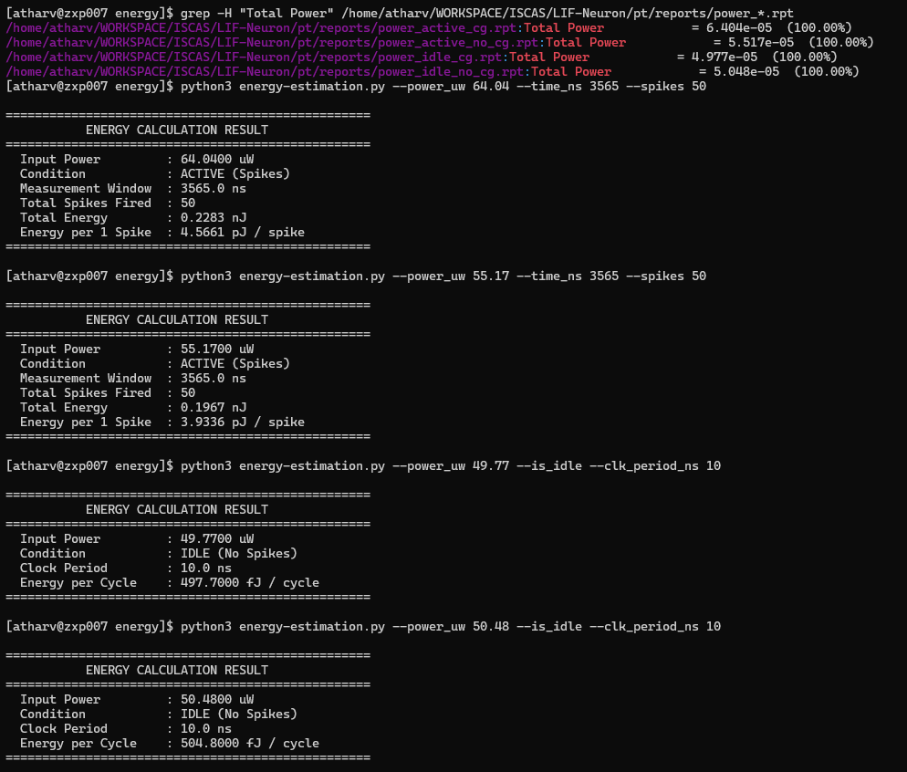
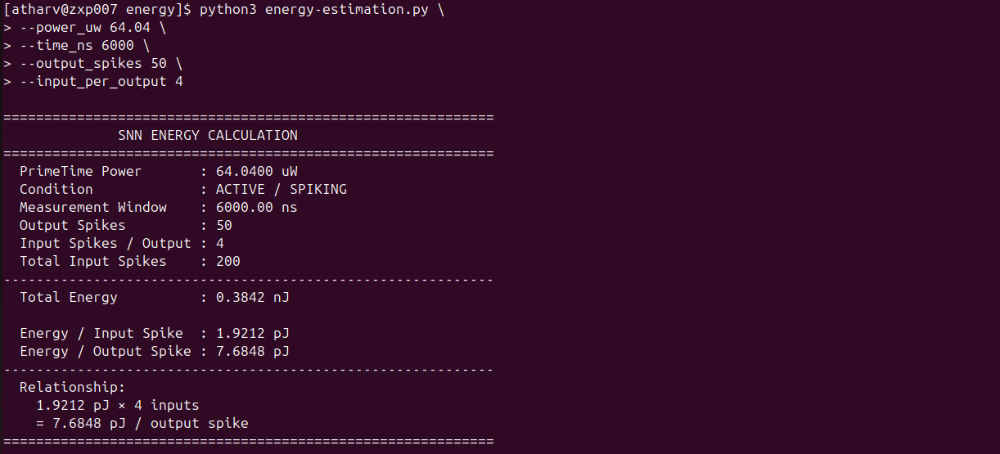
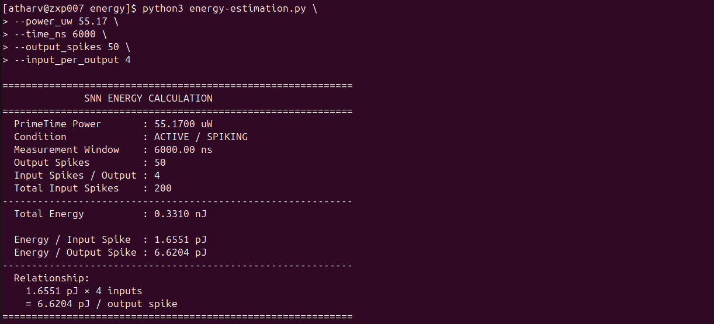
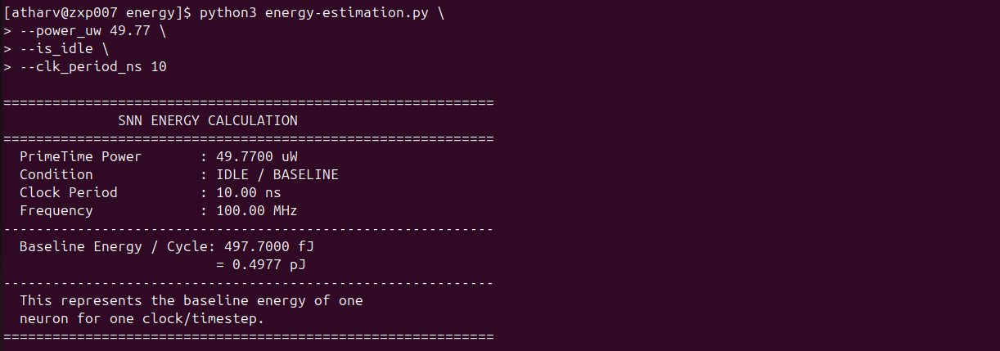
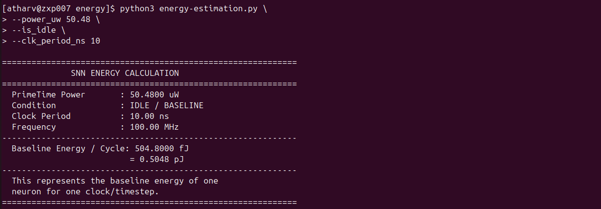

# LIF Neuron

## Overview

### 1. The Energy Formulation

To compute the energy per spike computation:

```math
\text{Energy per Spike } (E_{\text{spike}}) = \frac{P_{\text{total}} \times T_{\text{sim}}}{N_{\text{spikes}}} = P_{\text{total}} \times T_{\text{spike\_period}}
```

Where:
* $P_{\text{total}} = P_{\text{dynamic}} + P_{\text{static}}$ (reported by PrimeTime-PX).
* $T_{\text{sim}}$ is the measurement time window.
* $N_{\text{spikes}}$ is the number of spike events processed in that window.

---

### 2. The 4 Target Scenarios

| Scenario | Clock Gating (DC) | Stimulus Activity (TB) |
| :--- | :--- | :--- |
| **Case 1** | **No CG** | **No Spike** (idle) |
| **Case 2** | **With CG** | **No Spike** (idle) |
| **Case 3** | **No CG** | **Active Spikes** (continuous integration & fire) |
| **Case 4** | **With CG** | **Active Spikes** |

---

### 3. Tool Flow & Pipeline

```text
[RTL: LIF_neuron.v, LIF.v, common.v]
                               │
            ┌──────────────────┴──────────────────┐
            ▼                                     ▼
   [DC Run 1: No-CG]                     [DC Run 2: With-CG]
   Output: lif_no_cg.v                   Output: lif_cg.v
   Output: lif_no_cg.sdc                 Output: lif_cg.sdc
            │                                     │
            └──────────────────┬──────────────────┘
                               ▼
                        [ModelSim (GLS)]
               Simulate Testbench against Netlists
            ┌──────────────────┴──────────────────┐
            ▼                                     ▼
     Mode: "No Spike"                      Mode: "Active Spikes"
     (i_svalid=0, idle)                    (continuous spikes injected)
     Output: idle.vcd                      Output: active.vcd
            │                                     │
            └──────────────────┬──────────────────┘
                               ▼
                      [PrimeTime PX (PTPX)]
         Reads: Tech Library (.db) + Netlist (.v) + Activity (.vcd)
                               │
                               ▼
                      Power Reports (.rpt)
               Calculate: Energy = Power × Time
```


### 4. Directory

```text
LIF-Neuron/
├── rtl/
│   ├── LIF_neuron.v                # Top RTL neuron design
│   ├── LIF.v                       # Threshold & leak parameter defines
│   └── common.v                    # State encodings & macros
├── tb/
│   └── tb_LIF_neuron.v             # Gate-level testbench (Idle + Active modes)
├── syn/
│   ├── run_dc.tcl                  # Design Compiler batch synthesis script
│   ├── output_files/
│   │   ├── LIF_neuron_no_cg.v      # Synthesized gate netlist (No-CG)
│   │   ├── LIF_neuron_no_cg.sdc    # Timing constraints (No-CG)
│   │   ├── LIF_neuron_cg.v         # Synthesized gate netlist (With-CG)
│   │   └── LIF_neuron_cg.sdc       # Timing constraints (With-CG)
│   └── reports/                    # DC area, timing, and gating reports
├── sim/
│   ├── run_sim.sh                  # ModelSim automated 4-run batch script
│   ├── run_sim.do                  # ModelSim DO macro file
│   ├── idle_no_cg.vcd              # Switching activity (Idle, No-CG)
│   ├── active_no_cg.vcd            # Switching activity (Active, No-CG)
│   ├── idle_cg.vcd                 # Switching activity (Idle, With-CG)
│   └── active_cg.vcd               # Switching activity (Active, With-CG)
├── pt/
│   ├── run_ptpx.tcl                # PrimeTime PX power analysis script
│   ├── ptpx.log                    # PrimeTime run log
│   └── reports/
│       ├── power_idle_no_cg.rpt    # Idle power breakdown without CG
│       ├── power_active_no_cg.rpt  # Active power breakdown without CG
│       ├── power_idle_cg.rpt       # Idle power breakdown with CG
│       └── power_active_cg.rpt     # Active power breakdown with CG
└── energy/
    └── energy-estimation.py              # CLI Python script to calculate pJ/spike
```

## Implementation

### Step 1. Synopsys DC Shell

Go to below directory:

    cd LIF-Neuron/syn

Run the command below:

    dc_shell -f run_dc.tcl | tee dc_synth.log

### Step 2. Gate-Level Simulation

Go to below directory:

    cd LIF-Neuron/sim

Run the command below:

    chmod +x run_sim.sh && ./run_sim.sh

### Step 3. PrimeTime (power estimation)

Go to below directory:

    cd LIF-Neuron/pt

Run the command below:

    pt_shell -f run_ptpx.tcl | tee ptpx.log

### Step 4. Energy Estimation (using python script)

Go to below directory:

    cd LIF-Neuron/energy

Run this to see; what value belongs to what configuration:

    grep -H "Total Power" /home/atharv/WORKSPACE/ISCAS/LIF-Neuron/pt/reports/power_*.rpt



Run the commands below:

#### 1. Active with Clock Gating
    python3 energy-estimation.py \
    --power_uw 64.04 \
    --time_ns 6000 \
    --output_spikes 50 \
    --input_per_output 4



#### 2. Active without Clock Gating
    python3 energy-estimation.py \
    --power_uw 55.17 \
    --time_ns 6000 \
    --output_spikes 50 \
    --input_per_output 4



#### 3. Idle with Clock Gating
    python3 energy-estimation.py \
    --power_uw 49.77 \
    --is_idle \
    --clk_period_ns 10



#### 4. Idle without Clock Gating
    python3 energy-estimation.py \
    --power_uw 50.48 \
    --is_idle \
    --clk_period_ns 10



---

## Result Summary

| Configuration     | Internal | Switching | Leakage |        Total |
| ----------------- | -------: | --------: | ------: | -----------: |
| **Idle, No CG**   |  38.3 µW |   9.12 µW | 3.03 µW | **50.48 µW** |
| **Active, No CG** |  42.0 µW |   10.2 µW | 3.03 µW | **55.17 µW** |
| **Idle, CG**      |  31.3 µW |   15.7 µW | 2.79 µW | **49.77 µW** |
| **Active, CG**    |  38.3 µW |   23.0 µW | 2.79 µW | **64.04 µW** |

## Energy Estimation for SNN

[Click here](https://github.com/klab-aizu/Energy-Estimation/blob/main/energy-estimation.md)

---
